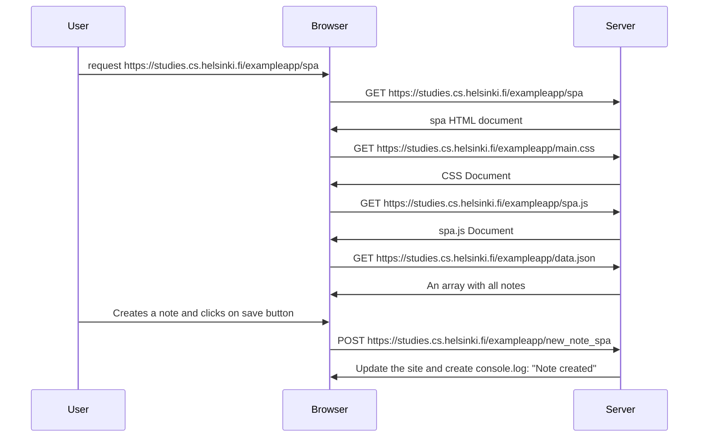

```mermaid
    sequenceDiagram
    User->>Browser: request https://studies.cs.helsinki.fi/exampleapp/spa
    Browser->>Server: GET https://studies.cs.helsinki.fi/exampleapp/spa
    Server->>Browser: spa HTML document
    Browser->>Server: GET https://studies.cs.helsinki.fi/exampleapp/main.css
    Server->>Browser: CSS Document
    Browser->>Server: GET https://studies.cs.helsinki.fi/exampleapp/spa.js
    Server->>Browser: spa.js Document
    Browser->>Server: GET https://studies.cs.helsinki.fi/exampleapp/data.json
    Server->>Browser: An array with all notes
    User->>Browser: Creates a note and clicks on save button
    Browser->>Server: POST https://studies.cs.helsinki.fi/exampleapp/new_note_spa
    Server->>Browser: Update the site and create console.log: "Note created"
```

